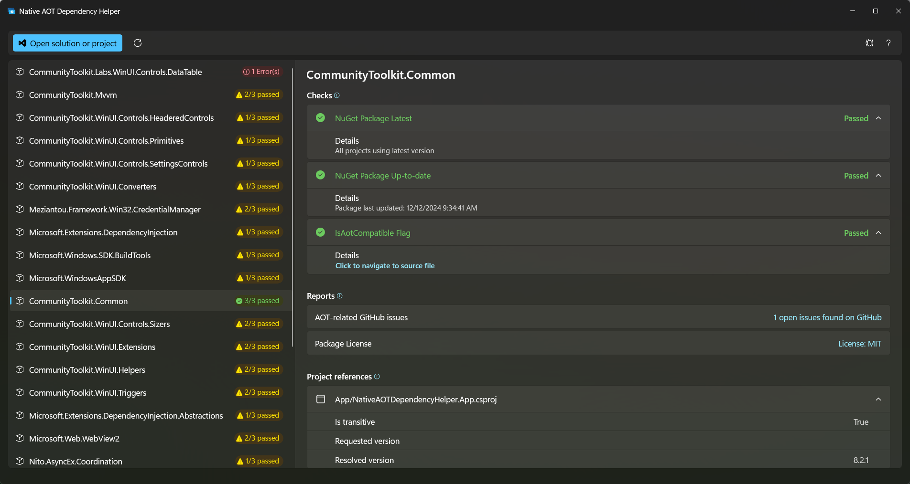

# Native AOT Dependency Helper Sample

This is a sample application which shows how to leverage MVVM techniques (using the [MVVM Toolkit](https://aka.ms/mvvmtoolkit/docs)) with [WinUI](https://aka.ms/winui).

You can learn more about the architecture used in this app from [this .NET Conf sample here](https://github.com/michael-hawker/MVVMNetConfApp) from the [MVVM Building Blocks for WinUI and WPF Development](https://www.youtube.com/watch?v=83UVWrfYreU&list=PLfYoThk3lXST-jocq53plkTnHy463d4xo&index=2) talk.

The app sceanario itself is meant for .NET developers who are looking to use [Native AOT](https://learn.microsoft.com/dotnet/core/deploying/native-aot/) to publish their application. (Further notes for [WinUI developers are here](https://learn.microsoft.com/windows/apps/windows-app-sdk/stable-channel#native-aot-support)). It provides an early litmus test for checking if your depedencies are AOT compatible before trying to enable and fix issues within your app itself.

If you are a library author and looking to understand how to make your library AOT compatible, [please see this blog here](https://devblogs.microsoft.com/dotnet/creating-aot-compatible-libraries/) at how to enable [IsAotCompatible](https://learn.microsoft.com/dotnet/core/deploying/native-aot/#aot-compatibility-analyzers) in your library.

## Overview

To use this app, simple clone and build the project within Visual Studio 17.12+ with the "Windows application development" workload.

Then click on the "Open .sln" button to get started.

The app will ask you to authenticate with GitHub to perform code searches on open source dependencies.

Once processing has completed, you'll be able to click on each dependency to see the information retrieved and status of checks performed.

## Current information and checks retrieved

The tool bubbles up the following data and performs a series of 'checks' to gauge how well a dependency may support AOT. However, it is not a blanket assurance that something will or won't support AOT for any given scenario. Just a starting point for understanding on your journey.

This information is retrieved and bubbled up for each dependency in your project, as well as general information like the package Id, whether or not its directly referenced or a transitive dependency, as well as the requested and resolved versions from each referencing project.

"Reports" just provide general information to bubble up for each package.

"Checks" look specifically for things that may indicate potential issues with AOT compatibility. Passing a check does **not** guarantee AOT compatibility, conversely failing a check indicated something to investigate or be aware of vs. it being strictly not able to function when AOT is turned on. These are aids to discovery of potentially short comings, known issues, or gaps with your dependency chain to be aware of before attempting to add this functionality to your application.

|  Type  |  Name             | Description                               |
|--------|-------------------|-------------------------------------------|
| Report | Package License   | Displays the license of the dependency    |
| Report | GitHub AOT Issues | Searches GitHub (if available) for open issues containing "AOT" |
| Check  | GitHub AOT Flag   | Searches GitHub source code (if available) for the ["IsAotCompatible" project flag](https://learn.microsoft.com/dotnet/core/deploying/native-aot/#aot-compatibility-analyzers) |
| Check  | NuGet Latest Version | Are you referencing the latest version available for the NuGet package |
| Check  | NuGet Recently Updated | Has this package been updated in the last year? |

All items contribute to overall progress of the scan; however, only checks are used as a final status per package overall.

Checks can have the following statuses:

- Unavailable - Not enough data/info was available to perform the check
- Error - An exception occurred while processing the check
- Warning - Something was discovered to investigate further
- Passed - Nothing outside the ordinary was discovered, though **does not** guarantee AOT compatibility

## Architecture

This section covers more about how this application is structured.

It consists of the three main projects below.

### NativeAOTDependencyHelper.Core

This is a base .NET Class Library which holds the majority of the logic in retrieving data and perfoming the analysis of a solution.

It is mean to be platform agnostic though does depend on being able to run the `dotnet` command line tool.

All the logic for various reports and checks is contained within here. That process is initiated by the `TaskOrchestrator` and retrieves the initial dependencies in the `SolutionPackageIndex`.

The `TaskOrchestrator` is responsible for parallelizing the various checks across all the different NuGet packages, but also ensuring that data is cached for reports/checks that rely on the same data (e.g. NuGet package listing). It handles all the threading and locking so that reports/checks don't need to worry about this and can remain relatively simple.

It is just important for reports/checks to call `GetDataFromSourceForPackageAsync` in order to retrieve data from a data source, as this will ensure that only a single remote request is made and cached data is used if available.

The `IDataSource` interface defines the contract in retrieving information about a specific NuGet package from its `NuGetPackageInfo`. The list of `NuGetPackageInfo` is provided by the `SolutionPackageIndex` as the starting point based on the provided information about the solutions/project dependencies and is just a basic object containing the NuGet package names (and which projects reference it with the requested version).

There are currently three data sources available:

- `NuGetDataSource` - This queries the [NuGet.org API](https://learn.microsoft.com/nuget/api/overview) to retrieve additional data about each package from the Service Index and its Nuspec file in package registration.
- `GitHubIssueSearchDataSource` - This queries [GitHub Issues](https://docs.github.com/en/rest/issues/issues?apiVersion=2022-11-28) to look for "AOT" in open issues.
- `GitHubAOTCompatibleCodeSearchDataSource` - This queries [GitHub Code Search](https://docs.github.com/en/rest/search/search?apiVersion=2022-11-28#search-code) to look for the `IsAotCompatbile` flag.

Data sources have an `InitializeAsync` function to implement and then a `GetInfoForPackageAsync` method to retrieve data about the given NuGet package. If they require data from other data sources, they should also retrieve that through the `GetDataFromSourceForPackageAsync` Task Orchestrator method. Dependencies are retrieved through [Dependency Injection](https://learn.microsoft.com/dotnet/communitytoolkit/mvvm/ioc), registration is in `App.xaml.cs` in the main application in `ConfigureServices`.

[`Octokit`](https://github.com/octokit/octokit.net) is used to retrieve GitHub data, otherwise we use standard HTTP REST for interacting with NuGet.org and use `System.Text.Json` for deserializing data. Authentication to GitHub is handled in `GitHubOAuthService`. The `ILogger` interface can be used to provide information in the UI operational log.

Both reports and checks implement the `IReportItemProvider` interface which provides information about the name and description of the item and simply implment the `ProcessPackage` method. Which takes in a `NuGetPackageInfo` and returns either a `ReportItem` for a report or an `AOTCheckItem` (which is itself a `ReportItem` + `CheckStatus`) for a check.

Remember that both new data sources and reports/checks need to be registered in the service configruation in `App.xaml.cs` in order to be detected and processed. This is also how they'll be able to access other dependent services and data sources through constructor injection. See the existing data sources, reports, and checks for examples.

### NativeAOTDependencyHelper.ViewModels

This is a relatively light project which contains ViewModels and helpers for encapsulating data from the Core project. It is also platform agnostic, thanks to the MVVM Toolkit.

It mostly consists of data aggregation calculations, progress tracking, and delegating to the UI thread. As well as the high-level `ICommand` (provided by `RelayCommand`) to call the underlying core methods to initiate the scanning process. See `ProcessSolutionFileAsync` in `MainViewModel`.

It also provided the implementation of the BasicLogger on top of the `ILogger` interface storing them as descrete typed records (for coloring within the UI via the new Windows Community Toolkit's [`SwitchConverter`](https://github.com/CommunityToolkit/Windows/pull/550) - created originally for this purpose in this repo!).

### NativeAOTDependencyHelper.App

This is the View layer and contains the WinUI application itself and how the data is presented.

Much of the view is currently contained within `MainPage.xaml` (using `MainViewModel`) with details for specific NuGet package info retrieved displayed in the `DetailsControl.xaml` user control (which uses the `NuGetPackageViewModel`). `MainWindow.xaml*` are responsible for configuring extending into the title bar of the application.

The majority of work is performed through data binding using MVVM and XAML techniques.

We leverage a variety of controls from the [Windows Community Toolkit](https://aka.ms/toolkit/windows), such as the Settings Controls, `SwitchPresenter`, `SwitchConverter`, and converters.

All the Dependency Injected services and components are registered in `App.xaml.cs`'s `ConfigureServices` method.

### Third-Party Notice

Via NuGet packages, this project depends on the following MIT licensed projects:

- The MVVM Toolkit
- The Windows Community Toolkit
- Microsoft.Extensions.DependencyInjection
- Nito.AsyncEx
- OctoKit

### Trademark Notice

Trademarks This project may contain trademarks or logos for projects, products, or services. Authorized use of Microsoft trademarks or logos is subject to and must follow Microsoft’s Trademark & Brand Guidelines. Use of Microsoft trademarks or logos in modified versions of this project must not cause confusion or imply Microsoft sponsorship. Any use of third-party trademarks or logos are subject to those third-party’s policies.

### License

This project is licensed under the MIT License, see the [LICENSE](LICENSE) file for more details.
